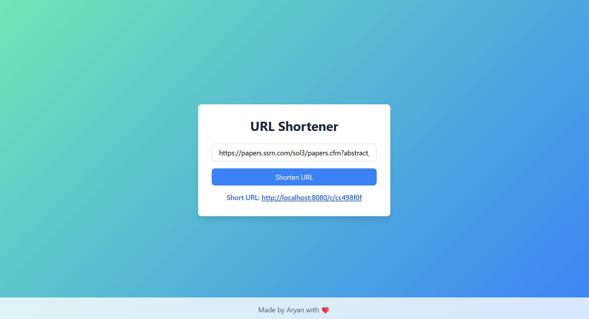

# 🚀 URL Shortener with Golang & DevOps

## 🌟 Overview
A simple yet powerful **URL Shortener Web App** built with **Golang**. This project follows DevOps best practices with **CI/CD on GitHub Actions** and supports **Docker & Minikube** for local deployment.

---

## 📸 Screenshots

| Web Page |
|-----------|
|  |

---

## 🎯 Features
✅ Shorten long URLs quickly 🔗  
✅ Redirect to the original URL 🚀  
✅ REST API with JSON support 🌐  
✅ Dockerized for easy deployment 🐳  
✅ Minikube & Kubernetes support ☸️  
✅ CI/CD using GitHub Actions ⚙️  

---

## 🛠️ Tech Stack
### 🖥️ Frontend  
- **HTML, CSS, JavaScript** – Simple UI for user interactions  
- **Tailwind CSS** – For styling the frontend  

### 🔗 Backend  
- **Golang** – Handles URL shortening logic  
- **Gin Framework** – Lightweight and fast web framework for handling API requests  

### 🛠️ DevOps  
- **Docker** – Containerized the application for easy deployment  
- **Kubernetes** – Manages containers and scaling using Minikube locally  
- **GitHub Actions** – CI/CD pipeline for automated code checks and quality analysis  


---

## 🚀 Getting Started

### 1️⃣ Clone the Repository
```sh
git clone https://github.com/yourusername/url-shortener.git
cd url-shortener
```

### 2️⃣ Install Dependencies
Ensure you have **Go 1.23** installed.
```sh
cd backend
go mod init url-shortener
go mod tidy
go mod verify
```

### 3️⃣ Run the Application
```sh
go run main.go
```
> App runs on `http://localhost:8080`

### 4️⃣ API Endpoints
| Method | Endpoint | Description |
|--------|---------|-------------|
| **POST** | `/shorten` | Shorten a long URL |
| **GET** | `/{shortURL}` | Redirect to the original URL |

Example Request (POST `/shorten`):
```json
{
  "long_url": "https://example.com"
}
```
Response:
```json
{
  "short_url": "http://localhost:8080/abcd123"
}
```

---

## 🐳 Docker Setup

### 1️⃣ Build & Run the Docker Container
```sh
docker build -t url-shortener .
docker run -p 8080:8080 url-shortener
```
> Access at `http://localhost:8080`

---

## ☸️ Kubernetes (Minikube) Deployment

### 1⃣ Start Minikube
```sh
minikube start
```

### 2⃣ Apply Kubernetes Manifests
```sh
kubectl apply -f k8s/deployment.yaml
kubectl get pods
```

### 3⃣ Port Forwarding
```sh
kubectl port-forward svc/url-shortener 8080:80
```
> Now accessible at `http://localhost:8080`  

### 🔄 Alternative: Expose Service via Minikube
If port forwarding doesn’t work, expose the service using Minikube:  
```sh
minikube service url-shortener
```
> This will open the application in your default browser with the correct Minikube IP. 🎯

---

## 🔄 CI/CD Pipeline (GitHub Actions)
This project uses **GitHub Actions** to automate:

✅ Code quality checks (Linting, Testing)  
✅ Building & pushing Docker images 🐳  

---

## 📜 License
This project is licensed under the [MIT License](LICENSE).

---

## 👨‍💻 Author
Developed by **Aryan** 💡

🚀 **Happy Coding!**
